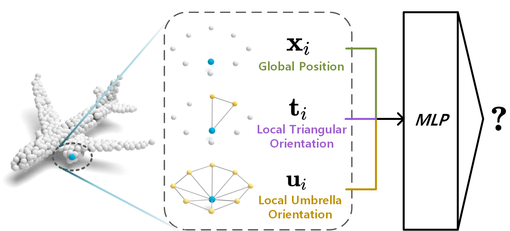

# RepSurf - Surface Representation for Point Clouds   [CVPR 2022 Oral]

By *[Haoxi Ran\*](https://github.com/hancyran) , Jun Liu, Chengjie Wang* ( * : corresponding contact)

  
  
  
  
  
 

### The pytorch official implementation of "[Surface Representation for Point Clouds](http://arxiv.org/abs/2205.05740)" ( [PDF](https://openaccess.thecvf.com/content/CVPR2022/papers/Ran_Surface_Representation_for_Point_Clouds_CVPR_2022_paper.pdf) | [arXiv](http://arxiv.org/abs/2205.05740) )

  

## News:
- (**Sep 10** NEW :fire:) We have uploaded the implementation of RepSurf on S3DIS.
- (**June 24** NEW :fire:) We sucessfully finished our Oral presentation at CVPR 2022!
- (**May 11**) We uploaded the implementation of RepSurf on ScanObjectNN.

## Tasks:

### We conduct experiments of different tasks on different codebases:

> Classification (./classification): **[3D Object Classification](./classification/README.md)**  
> Segmentation (./segmentation): **[3D Semantic Segmentation](./segmentation/README.md)**

## Visualization

We provide several visualization results in the folder **./visualization** for a closer look at the construction of
RepSurf.

## License

RepSurf is under the Apache-2.0 license. Please contact the primary author **Haoxi Ran (ranhaoxi@gmail.com)** for
commercial use.
